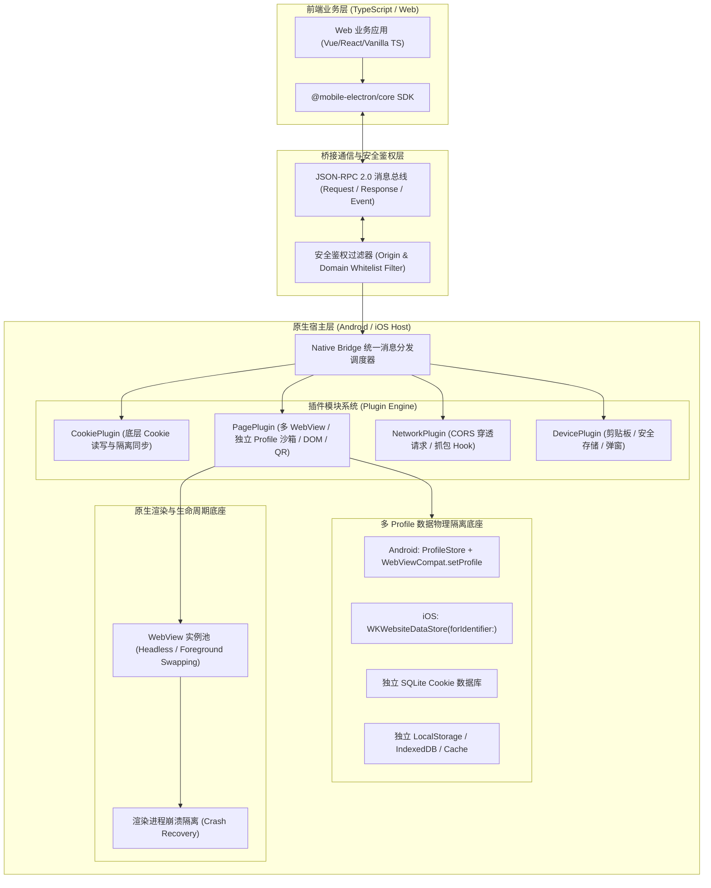

# 商业级 Mobile Electron 容器架构设计规范 (RFC-001)

## 1. 架构愿景与设计哲学
本产品旨在为移动端（Android & iOS）提供一个类似 **Electron / Puppeteer** 的安全跨端混合运行环境。通过原生渲染底座与现代 TypeScript SDK，实现对 WebView、网络请求、Cookie 和多页面生命周期的极深掌控力，同时通过严格的**白名单与分级权限沙箱**保障企业数据与终端安全。

---

## 2. 核心系统架构图



---

## 3. 安全分级与域名白名单体系

为了防止第三方页面或恶意注入滥用高危原生接口，所有 API 划分为三个安全等级：

| 权限等级 (Tier) | 代表性接口 | 默认准入策略 | 典型应用场景 |
| :--- | :--- | :--- | :--- |
| **Tier 0: 公开基础** | `device.getInfo`, `ui.toast` | 所有加载的页面均可调用 | 版本检测、状态提醒 |
| **Tier 1: 业务受信** | `clipboard.read/write`, `storage.get/set`, `page.getTitle` | 仅限白名单匹配的业务域名 | 内部业务 Web 页面 |
| **Tier 2: 核心特权** | `cookie.getAll`, `cookie.set`, `page.create`, `network.fetchNative` | 仅限高度受信的核心域名 (支持通配符/二级域) | 自动化登录、数据抓取、跨域通信 |

### 白名单匹配规则
1. **严格协议校验**：仅支持 `https://`（开发调试阶段可放行 `http://localhost` 或本地 IP）。
2. **域名匹配模式**：
   - 精确匹配：`auth.example.com`
   - 通配符匹配：`*.example.com`（匹配任何子域，如 `m.example.com`，但不匹配 `evil-example.com`）
3. **调用链实时鉴权**：在 Native 接收到每次 RPC 请求时，从原生 WebView 栈中取真实的请求发起方 Frame Origin 进行校验，坚决防御 Iframe 劫持与重定向欺骗。

---

## 4. 多 Profile / Partition 独立数据目录物理隔离机制

在商业爬虫、多账号托管、企业多租户场景下，多个 WebView 实例必须支持**完全独立的数据沙箱目录**，防止账户串号与 Cookie 污染。

### 4.1 Android 端实现原理 (`ProfileStore`)
在 Android 平台，结合 `androidx.webkit:webkit:1.11.0+`，通过 Chromium 提供的 `MULTI_PROFILE` 特性实现物理隔离：
- **核心类**：`androidx.webkit.ProfileStore` 与 `androidx.webkit.Profile`。
- **绑定时机**：在 `WebView` 实例构造后、加载任何 URL 或执行 JS 之前，调用 `WebViewCompat.setProfile(webView, profileName)`。
- **数据分区隔离范围**：
  1. `CookieManager`：每个 Profile 独立拥有物理 SQLite 存储文件，互不干扰；
  2. `WebStorage`：`localStorage`、`sessionStorage`、`IndexedDB` 独立持久化分区；
  3. HTTP 缓存与渲染临时文件独立隔离；
  4. 支持一键删除 Profile (`ProfileStore.deleteProfile(name)`) 彻底清除持久化数据。

### 4.2 iOS 端实现原理 (`WKWebsiteDataStore`)
在 iOS 平台，通过 WebKit 提供的持久化分区存储机制实现：
- **持久化隔离**：使用 `WKWebsiteDataStore(forIdentifier: UUID)`，每个 Profile 对应专属 UUID，所有 Cookie 及 WebKit 存储持久化于独立沙箱目录；
- **临时隐身隔离**：使用 `WKWebsiteDataStore.nonPersistent()`，内存级零落地隔离；
- **配置绑定**：将 `WKWebViewConfiguration.websiteDataStore` 赋值为专属 DataStore，再实例化 `WKWebView`。

### 4.3 跨平台对比与降级策略

| 特性 | Android (Chromium 底座) | iOS (WebKit 底座) |
| :--- | :--- | :--- |
| **API 入口** | `ProfileStore.getInstance().getOrCreateProfile(name)` | `WKWebsiteDataStore(forIdentifier: uuid)` |
| **绑定方法** | `WebViewCompat.setProfile(webView, name)` | `config.websiteDataStore = customStore` |
| **支持版本** | Android 5.0+ 配合最新 Android System WebView (M105+) | iOS 17+ (持久化分区) / iOS 9+ (内存非持久化) |
| **降级兜底** | 若底层不支持 `MULTI_PROFILE`，标记 `multiProfileSupported: false`，使用会话级命名空间隔离与切换前自动清理 | iOS 17 以下自动降级为 `WKWebsiteDataStore.nonPersistent()` |

---

## 5. 硬件参数注入与设备指纹虚拟化规范 (Hardware Spoofing & Stealth)

在自动化风控对抗、多账号多设备隔离（Anti-Detect Browser）等商业化场景中，网页常通过采集设备硬件参数（CPU、内存、GPU、屏幕、触控）识别真实设备。Mobile Electron 提供了底层硬件参数注入与防检测（Stealth）伪装底座。

### 5.1 虚拟化硬件参数指标集

| 硬件维度 | Web 探测 API | 注入实现方式 | 默认/典型伪装值 |
| :--- | :--- | :--- | :--- |
| **CPU 核心数** | `navigator.hardwareConcurrency` | 原型链 Getter 拦截 + `[native code]` 伪装 | `8` 或 `16` 核 |
| **设备内存** | `navigator.deviceMemory` | 原型链 Getter 拦截 (单位 GB) | `8` 或 `16` GB |
| **GPU 显卡厂商** | `WebGLRenderingContext` / `UNMASKED_VENDOR_WEBGL` | `getParameter(0x9245)` 代理拦截 | `Qualcomm` / `Apple Inc.` |
| **GPU 渲染器** | `WebGLRenderingContext` / `UNMASKED_RENDERER_WEBGL` | `getParameter(0x9246)` 代理拦截 | `Adreno (TM) 740` / `Apple GPU` |
| **触控硬件** | `navigator.maxTouchPoints` | 原型链 Getter 拦截 | 移动端 `5` 或 `10`，桌面端 `0` |
| **系统架构** | `navigator.platform` | 原型链 Getter 拦截 | `Linux aarch64` / `Win32` |
| **屏幕分辨率** | `screen.width/height`, `devicePixelRatio` | `Screen.prototype` 属性动态劫持 | 可动态模拟指定旗舰机屏幕 |

### 5.2 DocumentStart 注入时序与防检测技术 (Stealth)

1. **时序保障 (DocumentStart)**：
   - **Android**：利用 `androidx.webkit` 的 `WebViewCompat.addDocumentStartJavaScript(webView, script, allowedOrigins)`，在 Chromium 构建 DOM 树前注入，早于页面任何 `<script>` 标签执行。
   - **iOS**：利用 `WKUserScript(source: script, injectionTime: .atDocumentStart, forMainFrameOnly: false)`。
2. **函数原生伪装 (`toString` Protection)**：
   所有重写的 Getter 及 `getParameter` 函数均注册在 WeakMap 中，代理 `Function.prototype.toString`，使其调用 `.toString()` 时均精准返回 `function get hardwareConcurrency() { [native code] }`，杜绝指纹检测脚本通过 `toString()` 发现 Hook 痕迹。

---

## 6. JSON-RPC 2.0 桥接协议规范

### 6.1 前端调用请求包 (Request Envelope)
```json
{
  "id": "rpc_1712345678000_abc12",
  "module": "page",
  "action": "create",
  "params": {
    "profile": "account_alpha",
    "userAgent": "MobileElectron/1.2.0",
    "hardware": {
      "cpuCores": 16,
      "deviceMemory": 32,
      "glRenderer": "Adreno (TM) 740"
    }
  },
  "timestamp": 1712345678000
}
```

### 6.2 原生响应包 (Response Envelope)
```json
{
  "id": "rpc_1712345678000_abc12",
  "code": 200,
  "data": {
    "pageId": "page_account_alpha_101",
    "profile": "account_alpha",
    "multiProfileSupported": true,
    "hardware": {
      "cpuCores": 16,
      "deviceMemory": 32,
      "glRenderer": "Adreno (TM) 740"
    }
  },
  "message": "success"
}
```

### 6.3 原生主动推送事件包 (Event Envelope)
```json
{
  "event": "network:responseCaptured",
  "data": {
    "pageId": "page_account_alpha_101",
    "url": "https://api.target.com/check_qr",
    "status": 200,
    "body": "{\"code\": 0, \"scanned\": true}"
  }
}
```

---

## 7. 错误码标准定义

| 状态码 | 含义 | 说明 |
| :--- | :--- | :--- |
| `200` | 成功 (Success) | 正常返回调用结果 |
| `401` | 未授权域名 (Unauthorized Domain) | 当前发起调用的 URL 不在特权白名单中 |
| `403` | 权限不足 (Forbidden Tier) | 该域名未获得调用该安全等级 API 的许可 |
| `404` | 模块/动作不存在 (Not Found) | 找不到对应的 Module 或 Action |
| `408` | 调用超时 (Timeout) | Native 执行操作超过预设时限（默认 15s） |
| `500` | 原生执行异常 (Execution Error) | 原生发生捕获的系统异常，返回详细错误提示 |
