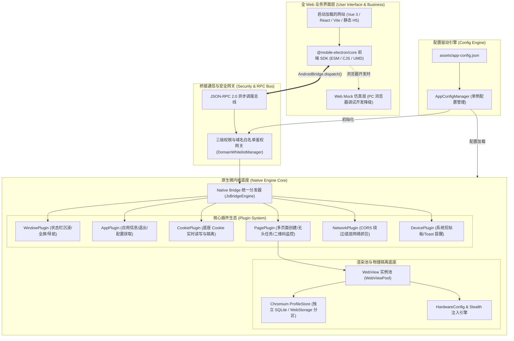

# Mobile Electron 跨端开发框架架构设计与产品技术规范

> **产品版本**：v2.0.0 Enterprise  
> **核心定位**：专为移动端打造的微内核跨端应用容器底座（"Mobile Electron / Puppeteer for Native"）  
> **产品哲学**：**Shell is Engine, UI is Web（原生即引擎，界面皆网页）**

---

## 1. 产品定位与核心价值分析

### 1.1 传统跨端方案 vs Mobile Electron 框架

在移动端混合开发领域，常见的方案包括传统的 Hybrid WebView（Cordova / Capacitor）、跨端渲染框架（React Native / Flutter）以及桌面端的 Electron：

| 维度对比 | 传统 Hybrid (Cordova/Capacitor) | 跨端引擎 (React Native/Flutter) | 桌面端 Electron | **Mobile Electron 框架 (本项目)** |
| :--- | :--- | :--- | :--- | :--- |
| **界面载体** | 网页 WebView | 原生组件 / 自绘引擎 | Chromium 窗口 | **100% 现代 Web 技术驱动** |
| **原生控制力** | 基础硬件（相机/地理位置） | 丰富但需要写大量原生桥接 | 拥有 Node.js 与操作系统最高权限 | **极深 WebView / Cookie / 网络掌控力** |
| **多账号隔离** | 无法隔离，全局共享一个 Cookie 库 | 需手动维护状态，容易串号 | 支持 Partition 物理目录隔离 | **Chromium Multi-Profile 硬件级物理隔离** |
| **设备指纹对抗** | 无反检测能力，易被风控识别 | 无 | 依赖外部 Puppeteer 插件 | **底层 DocumentStart 硬件伪装与反检测** |
| **开发与发布成本** | 需熟悉原生打包与原生插件 | 学习成本极高，编译繁琐 | 仅面向桌面端 | **仅需发布一个网站，配置即成独立 App** |

### 1.2 核心价值主张 (Value Propositions)
1. **零原生开发门槛**：前端工程师无需掌握 Java / Kotlin / Swift，使用熟悉的 Vue / React / Vite 开发任意网站，即可通过 `@mobile-electron/core` SDK 自由调用移动端系统级特权能力。
2. **业务即发即改**：所有界面与业务逻辑均部署在远端或本地资源包，更新无需重新走应用商店审核，实现毫秒级动态迭代。
3. **企业级多租户与多账号防串号**：支持同时后台静默运行多个相互物理隔离的 WebView，各自独立拥有 SQLite Cookie 数据库及 LocalStorage，绝无串号泄漏风险。
4. **反指纹与风控防御**：内置旗舰机硬件指纹注入引擎，解决移动端网页端登录、爬虫、自动化监控的防封与反反爬痛点。

---

## 2. 总体系统架构设计



---

## 3. 核心机制设计

### 3.1 配置驱动启动机制 (Config-Driven Runtime)
App 启动时由 `AppConfigManager` 读取 `assets/app-config.json`：
- **`window.defaultUrl`**：指定启动加载的目标网站，支持 `file:///android_asset/...`（离线本地网站）或 `https://...`（线上生产部署的 SPA 站点）；
- **`window.immersiveStatusBar` & `window.fullscreen`**：控制原生状态栏沉浸与全屏模式；
- **`window.showNativeDebugToolbar`**：控制是否开启原生调试工具栏（生产环境为 `false`，全屏 100% 交由 Web 渲染；排错时可通过 SDK 接口或配置开启）；
- **`security.whitelist`**：动态注入特权域名白名单。

### 3.2 物理级多 Profile 数据沙箱隔离
在多账号、自动化登录或多任务场景下，框架借助 Android 底层 `androidx.webkit.ProfileStore`：
- 每个任务页面绑定唯一的 Profile 标识（如 `account_01`）；
- Chromium 为每个 Profile 创建独立的物理沙箱文件夹，内部包括：
  1. 独立的 SQLite Cookie 数据库（Cookie 写入时不污染主应用和其他账号）；
  2. 独立的 LocalStorage、SessionStorage 与 IndexedDB 存储目录；
  3. 独立的 HTTP 缓存分区；
- 支持前端调用 `electron.browser.deleteProfile(name)` 物理级彻底销毁该分区。

### 3.3 全维度硬件指纹注入与防检测体系 (Stealth Engine)
为了应对现代商业级风控（如 CreepJS, FingerprintJS Pro, Cloudflare, Akamai, 抖音风控）的设备软硬件特征采集与反反爬识别，框架构建了全维度的底层硬件参数注入与 Stealth 伪装引擎：

| 硬件维度分类 | 具体采集 API 与探测指标 | 框架注入与伪装实现方式 | 典型移动端拟真值 |
| :--- | :--- | :--- | :--- |
| **CPU 计算硬件** | `navigator.hardwareConcurrency` | `Navigator.prototype` 原型链 Getter 代理拦截 | `8` 或 `16` 核 |
| **设备运行内存** | `navigator.deviceMemory` | 原型链 Getter 拦截 (单位 GB) | `8` 或 `16` GB |
| **Client Hints 高熵硬件** | `navigator.userAgentData.getHighEntropyValues` | 拦截重写 `model`, `architecture`, `bitness` | `model: 'SM-S9280'`, `architecture: 'arm64'` |
| **触控传感器硬件** | `navigator.maxTouchPoints` | 原型链 Getter 拦截 | 移动端 `5` 或 `10`，桌面端 `0` |
| **系统平台架构** | `navigator.platform` | 原型链 Getter 拦截 | `Linux aarch64` / `iPhone` |
| **显卡 GPU 厂商** | `WebGL / WebGL2` (`UNMASKED_VENDOR_WEBGL`) | `gl.getParameter(0x9245)` 代理拦截 | `Qualcomm` / `Apple Inc.` |
| **显卡 GPU 渲染器** | `WebGL / WebGL2` (`UNMASKED_RENDERER_WEBGL`) | `gl.getParameter(0x9246)` 代理拦截 | `Adreno (TM) 750` / `Apple GPU` |
| **显卡调试扩展** | `gl.getExtension('WEBGL_debug_renderer_info')` | 代理拦截保证扩展永远受支持并可读 | 返回调试 Vendor & Renderer 常量对象 |
| **屏幕物理分辨率** | `screen.width`, `screen.height`, `availWidth/Height` | `Screen.prototype` 属性动态劫持 | `1080 x 2400` / `393 x 852` |
| **屏幕色彩深度** | `screen.colorDepth`, `screen.pixelDepth` | `Screen.prototype` 属性动态劫持 | `24` bit |
| **屏幕像素密度比** | `window.devicePixelRatio` | 动态劫持 `window.devicePixelRatio` | `2.75` / `3.0` |
| **声卡音频硬件指纹** | `AudioBuffer.prototype.getChannelData` | Web Audio API 注入极微小高阶浮点微扰 | 阻断跨域声卡硬件浮点唯一 Hash 追踪 |
| **电池电源硬件** | `navigator.getBattery()` | 拦截注入 `BatteryManager` 拟真电量与充电状态 | `level: 0.88`, `charging: false` |
| **网卡硬件连接** | `navigator.connection` | 拦截注入 `effectiveType`, `downlink`, `rtt` | `effectiveType: '5g'`, `downlink: 20` |

#### 防检测对抗保障机制 (Anti-Fingerprint Defenses)：
1. **时序前置 (DocumentStart Guarantee)**：
   - Android 利用 `androidx.webkit.WebViewCompat.addDocumentStartJavaScript` 在任何 DOM 节点与页面 `<script>` 解析前执行；
   - iOS 利用 `WKUserScript(injectionTime: .atDocumentStart)` 进行底层预置；
   - **主页面与所有后台无头沙箱页面 100% 全覆盖注入**。
2. **原型链深度保护 (Prototype Chain Protection)**：
   - 严禁直接在 `navigator` 或 `screen` 实例自身定义属性（规避 `hasOwnProperty` 篡改检测）；全部严格挂载于 `Navigator.prototype` 与 `Screen.prototype` 上，属性描述符统一为 `{ configurable: true, enumerable: true, get: [native code], set: undefined }`。
3. **Function.prototype.toString 递归防检测**：
   - 所有拦截函数代理 `Function.prototype.toString`，调用时精准输出 `function get <prop>() { [native code] }`；
   - 保护 `Function.prototype.toString.toString()` 自身，彻底杜绝风控检测脚本识别 Hook 痕迹。

### 3.4 桥接协议与三级安全网关 (JSON-RPC 2.0)
- **协议格式**：
  ```json
  // Request
  { "id": "rpc_101", "module": "cookie", "action": "get", "params": { "url": "https://target.com" } }
  // Response
  { "id": "rpc_101", "code": 200, "data": { "cookies": "..." }, "message": "success" }
  ```
- **权限安全分级**：
  - **Tier 0 (公开级)**：`device.toast`, `window.reload`, `window.goBack`, `app.getInfo`（任何页面可调用）；
  - **Tier 1 (业务级)**：`device.get/setClipboard`, `window.setStatusBar`（仅限受信域名调用）；
  - **Tier 2 (核心特权级)**：`cookie.*`, `page.create`, `network.fetchNative`（仅限严格白名单域名调用，杜绝第三方恶意脚本提权）。
