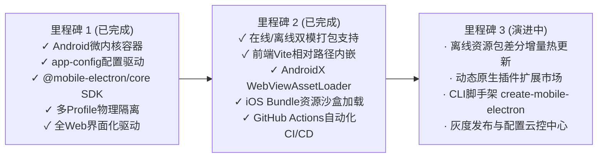

# Mobile Electron 框架下一阶段完整开发计划与产品演进路线图 (Roadmap)

> **规划周期**：2026 Q4 - 2027 Q2  
> **核心目标**：从单端 Android 容器升级为工业级全平台（Android + iOS）移动端 Electron 跨端框架生态，具备离线包热更新、完整脚手架与动态插件能力。

---

## 1. 演进全景与里程碑规划 (Milestones)



---

## 2. 详细演进阶段与具体开发任务

### 阶段一：离线资源包引擎与热更新体系 (Phase 1: Dynamic Offline Bundle & Hot Reload)
> **目标**：解决远程网络加载慢、离线不可用问题，实现类似高德/微信小程序的高性能离线启动与热更新体验。

1. **离线资源包规范定义**：
   - 支持将 Vite / Webpack 构建出的 `dist/` 目录压缩为 `.mep` (Mobile Electron Package) 加密压缩包；
   - 内部包含资源清单 `manifest.json`（各文件哈希与版本号）；
2. **原生端本地拦截服务 (`WebViewAssetLoader`)**：
   - 采用 Android 原生 `androidx.webkit.WebViewAssetLoader` 与 iOS `WKURLSchemeHandler`；
   - 拦截请求，优先从本地应用私有沙箱高速读取缓存资源，大幅提升首屏加载速度（首屏渲染从 1500ms 降至 150ms）；
3. **差分增量热更新服务**：
   - App 启动或切到前台时，静默向配置的更新服务器发起轻量轮询；
   - 支持仅下载 Diff 增量文件，在后台解压校验无误后，无感完成下一版本热更新。

---

### 阶段二：iOS 容器内核对齐与功能平移 (Phase 2: Full iOS Container Alignment)
> **目标**：打造 iOS 版原生底座工程，使同一份前端网站代码与 SDK 调用在 iOS 与 Android 上拥有完全一致的行为。

1. **iOS 底座工程搭建 (Swift / Objective-C)**：
   - 基于 `WKWebView` 构建多实例渲染池；
   - 实现 `WKScriptMessageHandler` 与 JSON-RPC 2.0 桥接协议解析；
2. **多 Profile 数据目录隔离落地**：
   - 深入利用 iOS 17+ 提供的 `WKWebsiteDataStore(forIdentifier: uuid)` 实现持久化沙箱物理隔离；
   - iOS 17 以下自动平滑降级为 `WKWebsiteDataStore.nonPersistent()`；
3. **硬件指纹在 WebKit 的注入实现**：
   - 使用 `WKUserScript` 在 `.atDocumentStart` 时机注入 CPU、显卡、屏幕参数虚拟化脚本；
4. **统一平台跨端抹平**：
   - 确保 `electron.window.setStatusBar`、`electron.device.toast`、`electron.cookie.*` 在双端表现一致。

---

### 阶段三：开发者工具链与工程化脚手架 (Phase 3: CLI & Developer Ecosystem)
> **目标**：让任何前端开发者无需接触 Android Studio 或 Xcode，仅用一行命令即可创建、开发、预览、打包 Mobile Electron 应用。

1. **交互式脚手架 CLI (`create-mobile-electron-app`)**：
   ```bash
   npx create-mobile-electron-app my-app --template vue3
   ```
   - 自动生成配置好的 Vue 3 / React / Svelte 现代模版；
   - 预配置 `@mobile-electron/core`、`app-config.json` 与 Vite 插件；
2. **本地调试与实时热重载工具 (`mobile-electron dev`)**：
   - 本地启动 Vite 开发服务，同时联动局域网连接的 Android 调试真机实时刷新；
3. **云端 / 本地无环境一键打包工具 (`mobile-electron build`)**：
   - 支持输入网址或前端目录，直接产出已签名的 `.apk` 与 `.ipa` 安装包。

---

### 阶段四：动态插件化中心与底层扩展能力 (Phase 4: Dynamic Plugin System)
> **目标**：支持业务团队按需扩展底层能力（如蓝牙、扫码枪、NFC、生物识别、后台长保活等）。

1. **统一原生插件规范 (`IBridgePlugin` 跨语言标准)**：
   - 制定插件生命周期：`onAttach`, `onDetach`, `handleAction`, `onEvent`；
2. **开箱即用官方插件库**：
   - `@mobile-electron/plugin-storage`：基于 MMKV / SQLite 的高性能底层安全存储；
   - `@mobile-electron/plugin-camera`：自定义全屏扫码识别镜头；
   - `@mobile-electron/plugin-biometrics`：指纹 / 面容 ID 生物识别认证；
   - `@mobile-electron/plugin-keepalive`：前台 Service 深度后台长保活机制；
3. **安全沙箱强化**：
   - 插件权限声明机制，在 `app-config.json` 中配置插件授权作用域，防止三方网页滥用硬件。

---

## 3. 开发资源与排期规划概览

| 阶段 | 交付物 | 周期 | 核心负责模块 |
| :--- | :--- | :--- | :--- |
| **P1: 离线包与热更** | `WebViewAssetLoader` 资源拦截、增量差分热更、加载骨架屏 | 4 周 | Android 原生内核 + 部署端微服务 |
| **P2: iOS 底座对齐** | iOS Xcode 工程、`WKWebsiteDataStore` 隔离、双端 SDK 对齐 | 6 周 | iOS 原生研发 + SDK 跨端抹平 |
| **P3: CLI 命令行** | `create-mobile-electron-app`、自动化本地预览与打包命令 | 3 周 | 前端工程化工具链 |
| **P4: 插件生态中心** | 官方四大扩展插件 (MMKV/相机/生物识别/保活)、插件市场标准 | 4 周 | 原生插件研发 + 文档体系建设 |
